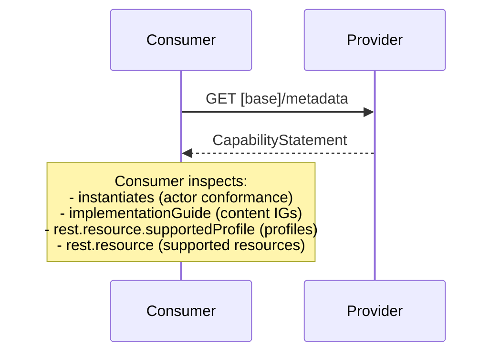

### Overview

Systems discover capabilities via FHIR CapabilityStatement (`GET /metadata`). Consumers inspect a provider's functionality before attempting transactions.

### Transaction

Capability discovery uses the standard FHIR capabilities interaction:

```
GET [base]/metadata
```

The server returns a CapabilityStatement resource that declares:
- Supported FHIR version
- Supported resource types and profiles
- Supported interactions (read, search, create, etc.)
- Supported search parameters
- Actor conformance and priority category support (see below)

### Provider Actors

Different provider actors advertise different capabilities:

- **Document Access Provider**: Advertises document exchange capabilities (MHD ITI-67, ITI-68 transactions; ITI-105 with Document Submission Option)
- **Resource Access Provider**: Advertises resource query capabilities (IPA patterns)

A system may implement one or both.

### Actor Conformance via `instantiates`

Servers declare actor conformance using `CapabilityStatement.instantiates`, referencing the normative CapabilityStatements in this IG:

- [Document Access Provider](CapabilityStatement-document-access-provider-eu-api.html)
- [Document Access Provider — Document Submission Option](CapabilityStatement-document-access-provider-submission-option-eu-api.html)
- [Grouped Document Publisher/Access Provider](CapabilityStatement-document-publisher-access-provider-eu-api.html)
- [Resource Access Provider](CapabilityStatement-resource-access-provider-eu-api.html)

Consumers inspect `instantiates` to determine which actor roles and exchange patterns a server supports.

### Priority Category Support

The EHDS ANNEX II priority categories are:

- European Patient Summary (EPS)
- Medication Prescription & Dispense (MPD)
- Laboratory Results
- Hospital Discharge Reports (HDR)
- Imaging Reports
- Imaging Manifests

Servers declare which priority categories they support by listing content IG canonical URLs in `CapabilityStatement.implementationGuide`. Consumers inspect `implementationGuide` to discover supported categories, then query by `DocumentReference.type` (LOINC) for specific document types. See [Document Exchange](document-exchange.html) for the type codes per priority category.

### Profile Declarations

The normative CapabilityStatements in this IG declare `supportedProfile` on:

- **DocumentReference** — the [EEHRxF MHD DocumentReference](StructureDefinition-document-reference-eu-api.html) profile and the base [MHD DocumentReference](https://profiles.ihe.net/ITI/MHD/StructureDefinition-IHE.MHD.Minimal.DocumentReference.html) profiles
- **Patient** — the [EU Core Patient](http://hl7.eu/fhir/base/StructureDefinition/patient-eu-core) profile

These tell consumers which resource profiles to expect.

### Example Capability Discovery Flow



### Example: Server Supporting Multiple Priority Categories

See the [example CapabilityStatement](CapabilityStatement-example-capabilitystatement-document-access-provider.html) for a Document Access Provider serving Patient Summaries and Laboratory Reports.

The key elements a consumer looks for:

```json
{
  "instantiates": [
    "...CapabilityStatement/document-access-provider-eu-api"
  ],
  "implementationGuide": [
    "http://hl7.eu/fhir/eps",
    "http://hl7.eu/fhir/laboratory"
  ],
  "rest": [{
    "resource": [{
      "type": "DocumentReference",
      "supportedProfile": [
        "...document-reference-eu-api",
        "...IHE.MHD.Minimal.DocumentReference"
      ]
    }, {
      "type": "Patient",
      "supportedProfile": [
        "...patient-eu-core"
      ]
    }]
  }]
}
```

### See Also
- [FHIR CapabilityStatement](https://hl7.org/fhir/R4/capabilitystatement.html)
- [Actors and Transactions](actors.html)
- [IHE MHD](https://profiles.ihe.net/ITI/MHD/)
- [Document Exchange](document-exchange.html)
