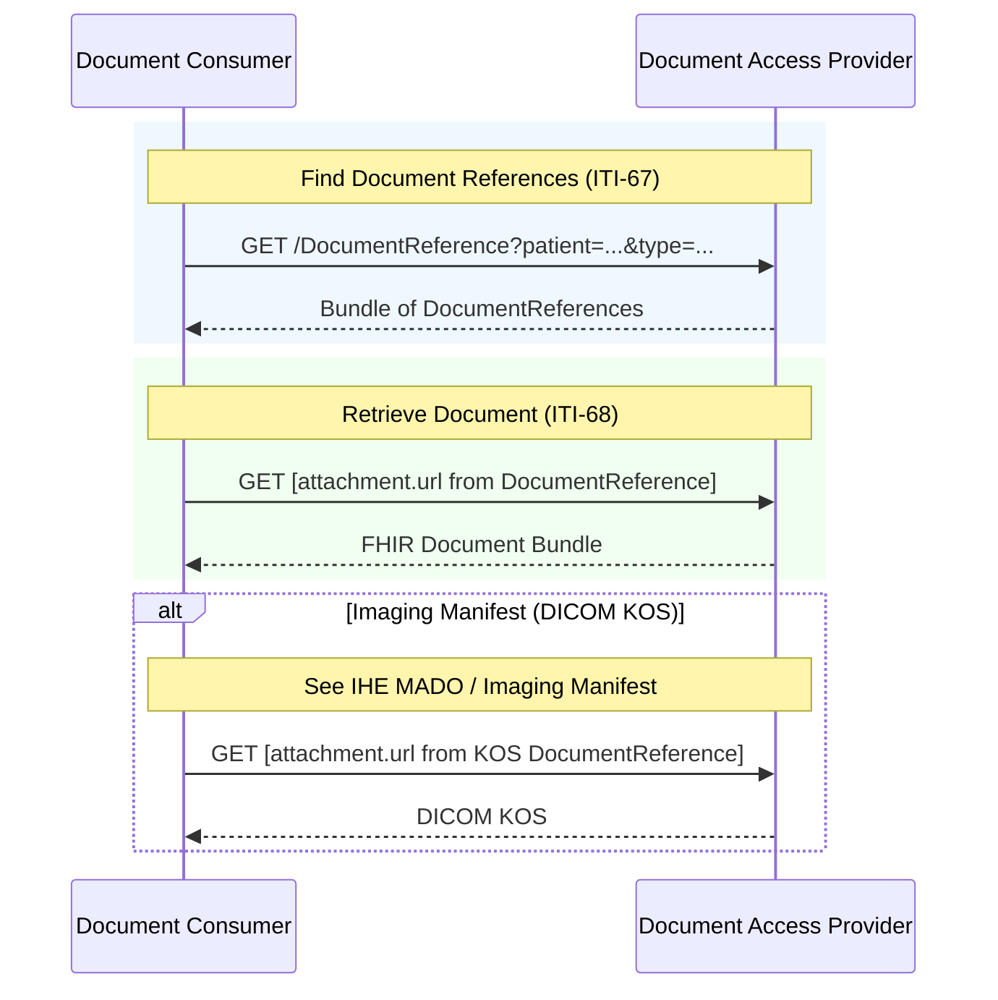

### Overview

Document exchange using IHE MHD (Mobile Health Documents) transactions. This IG inherits MHD transactions as-is, with constraints specific to EEHRxF content.

For how different server backends (FHIR-native on-demand vs persisted/XDS-bridge) implement these transactions, see [Relationship to XDS/FHIR Document Sharing](background-xds-fhir.html).

<div>
<figure class="figure">

<figcaption class="figure-caption"><strong>Figure: Document Exchange Overview</strong></figcaption>
</figure>
</div>

### Actors and Transactions

This IG defines three document exchange actors. See [Actors](actors.html) for detailed actor groupings.

| Actor | MHD Actor | Transaction | Optionality |
|-------|-----------|-------------|-------------|
| [Document Consumer](actors.html#document-consumer) | [Document Consumer](https://profiles.ihe.net/ITI/MHD/1331_actors_and_transactions.html#133112-document-consumer) | [ITI-67](https://profiles.ihe.net/ITI/MHD/ITI-67.html) Find Document References | R |
| [Document Consumer](actors.html#document-consumer) | [Document Consumer](https://profiles.ihe.net/ITI/MHD/1331_actors_and_transactions.html#133112-document-consumer) | [ITI-68](https://profiles.ihe.net/ITI/MHD/ITI-68.html) Retrieve Document | R |
| [Document Access Provider](actors.html#document-access-provider) | [Document Responder](https://profiles.ihe.net/ITI/MHD/1331_actors_and_transactions.html#133114-document-responder) | [ITI-67](https://profiles.ihe.net/ITI/MHD/ITI-67.html) Find Document References | R |
| [Document Access Provider](actors.html#document-access-provider) | [Document Responder](https://profiles.ihe.net/ITI/MHD/1331_actors_and_transactions.html#133114-document-responder) | [ITI-68](https://profiles.ihe.net/ITI/MHD/ITI-68.html) Retrieve Document | R |
| [Document Access Provider](actors.html#document-access-provider) | [Document Recipient](https://profiles.ihe.net/ITI/MHD/1331_actors_and_transactions.html#133113-document-recipient) | [ITI-105: Simplified Publish](https://profiles.ihe.net/ITI/MHD/ITI-105.html) | O |
| [Document Publisher](actors.html#document-publisher) | [Document Source](https://profiles.ihe.net/ITI/MHD/1331_actors_and_transactions.html#133111-document-source) | [ITI-105: Simplified Publish](https://profiles.ihe.net/ITI/MHD/ITI-105.html) | R |
{: .grid}


---

### Document Consumption

The primary workflow is **query and retrieve**: Document Consumers find documents via ITI-67, then retrieve content via ITI-68.

#### Sequence Diagram



#### Document Content

[ITI-68](https://profiles.ihe.net/ITI/MHD/ITI-68.html) retrieves the document from the URL in `DocumentReference.content.attachment.url`. Consumers identify the content using two DocumentReference elements:

- **`type`** (LOINC code) — identifies the clinical document type and which [content IG](priority-categories.html) applies.
- **`attachment.contentType`** — identifies the technical format.

Together, these tell the consumer what the retrieved document contains.

| Content Pattern | `attachment.contentType` | Retrieved Content | Example |
|---|---|---|---|
| FHIR Document | `application/fhir+json` or `application/fhir+xml` | FHIR Document Bundle (`Bundle.type = "document"`) | `/Bundle/[id]` |
| Non-FHIR | `application/dicom` | Binary content (DICOM KOS) | `/Binary/[id]` |
{: .grid}

Servers SHALL return content conforming to FHIR Document content profiles as a native FHIR Document Bundle, not wrapped in Binary. For DICOM KOS imaging manifests ([IHE MADO](priority-area-imaging-manifest.html#ihe-mado)), standard MHD behavior applies.

`attachment.url` is an opaque retrieval URL — its format is unconstrained. Servers host content at any endpoint they choose. The examples above (`/Bundle/[id]`, `/Binary/[id]`) illustrate common patterns, not requirements.

Human-readable representations (e.g. PDF narrative) are part of the FHIR Document as defined by the relevant [content IG](priority-categories.html) — not exposed at metadata level as separate DocumentReferences.

#### Document Search Strategy

[IHE Document Sharing](https://profiles.ihe.net/ITI/HIE-Whitepaper/index.html) distinguishes `type` (specific document types, typically LOINC codes) from `category` (broad classification) on DocumentReference. This IG constrains `type` for document discovery but leaves `category` to [content IGs](priority-categories.html) and implementations.

##### EHDS Priority Categories and Type Codes

[Article 14](https://eur-lex.europa.eu/eli/reg/2025/327/oj#d1e2289-1-1) of the EHDS regulation defines six priority categories of electronic health data. [EEHRxFDocumentPriorityCategoryCS](CodeSystem-eehrxf-document-priority-category-cs.html) provides informative codes for these categories, organizing them by the LOINC `type` codes consumers use for document search.

Each priority category has a ValueSet of known LOINC type codes:
- `Patient-Summaries` → [EEHRxFDocumentTypePatientSummaryVS](ValueSet-eehrxf-document-type-patient-summary-vs.html)
- `Discharge-Reports` → [EEHRxFDocumentTypeDischargeReportVS](ValueSet-eehrxf-document-type-discharge-report-vs.html)
- `Laboratory-Reports` → [EEHRxFDocumentTypeLaboratoryReportVS](ValueSet-eehrxf-document-type-laboratory-report-vs.html)
- `Medical-Imaging` → [EEHRxFDocumentTypeMedicalImagingVS](ValueSet-eehrxf-document-type-medical-imaging-vs.html)
`Electronic-Prescriptions` and `Electronic-Dispensations` fall outside the document exchange model and have no type codes.

[EEHRxFDocumentTypeVS](ValueSet-eehrxf-document-type-vs.html) aggregates all per-category type codes into a single ValueSet bound to `DocumentReference.type`. A [ConceptMap](ConceptMap-EehrxfMhdDocumentReferenceCM.html) provides the same mapping in machine-readable form.


| priority category | type codes | relevant IGs |
|-------------------|------------|--------------|
| Patient-Summaries | 60591-5 | [Europe Patient Summary](https://build.fhir.org/ig/hl7-eu/eps/) |
| Discharge-Reports | 18842-5, 100719-4 | [Hospital Discharge Report](https://build.fhir.org/ig/hl7-eu/hdr/) |
| Laboratory-Reports | 11502-2 | [Europe Laboratory Report](https://hl7.eu/fhir/laboratory/) |
| Medical-Imaging | 85430-7, 18748-4 | [Europe Imaging Reports](https://build.fhir.org/ig/hl7-eu/imaging-r5/en/) |
{: .grid}

<div markdown="1" class="stu-note">

**Feedback requested on `category` and document differentiation in search.** This IG uses `DocumentReference.type` with LOINC codes as the primary search parameter for distinguishing priority categories. The use of `.category` is left to the needs of the implementation.

The EHDS priority categories (Patient Summary, Laboratory Report, etc.) are regulatory groupings that no established code system defines today. A coarse-grained search parameter grouping documents by `category` — independent of their specific LOINC `type` code — could simplify consumer logic, especially as code sets evolve. For example, the `category` field could represent priority categories or another classification scheme for search.

Implementers: Does your system use or plan to use `category` for document classification? Would constraining `category` to the EHDS priority categories be useful for your search workflows, or conflict with other category schemes? Are there other good code sets for differentiating, for example, laboratory reports from imaging reports?

</div>

#### Search Examples

Search by `type` (LOINC) for the most accurate results. To find the relevant `type` codes for a priority category, consult the per-category ValueSet or the ConceptMap. When multiple `type` codes apply, include all of them.

These examples assume the consumer has resolved the patient to a FHIR reference (e.g., `Patient/123`) via [Patient Matching](patient-match.html). Alternatively, use [chained identifier search](patient-match.html#option-chained-identifier-search) (e.g., `patient.identifier=[system]|[value]`).

##### Patient Summary

By type (LOINC):
```
GET [base]/DocumentReference?patient=Patient/123&type=http://loinc.org|60591-5&status=current
```

##### Medical Test Results (Laboratory)

By type (LOINC):
```
GET [base]/DocumentReference?patient=Patient/123&type=http://loinc.org|11502-2&status=current
```

##### Imaging Reports and Manifests

By type (LOINC — imaging reports):
```
GET [base]/DocumentReference?patient=Patient/123&type=http://loinc.org|85430-7&status=current
```

By type (LOINC — imaging study manifests):
```
GET [base]/DocumentReference?patient=Patient/123&type=http://loinc.org|18748-4&status=current
```

> Imaging manifests may use the [dual-DocumentReference pattern](priority-area-imaging-manifest.html#dual-documentreference-pattern-mado): two DocumentReferences (FHIR and DICOM KOS) linked via `relatesTo.transforms`. Consumers select the representation they support based on `contentType`.

##### Hospital Discharge Reports

By type (LOINC):
```
GET [base]/DocumentReference?patient=Patient/123&type=http://loinc.org|18842-5,http://loinc.org|100719-4&status=current
```

---

### Document Publication

When Document Publisher and Document Access Provider are **separate systems**, the Publisher submits documents using [ITI-105 Simplified Publish](https://profiles.ihe.net/ITI/MHD/ITI-105.html) per the [MHD Simplified Publish Option](https://profiles.ihe.net/ITI/MHD/1332_actor_options.html#13324-simplified-publish-option). When they are **grouped** (co-located), publication is internal.

#### Document Submission Option

The Document Access Provider MAY support receiving documents from external Publishers by implementing the [MHD Simplified Publish Option](https://profiles.ihe.net/ITI/MHD/1332_actor_options.html#13324-simplified-publish-option). This is the **Document Submission Option**.

Systems implementing this option declare it via [EEHRxF-DocumentAccessProvider-SubmissionOption](CapabilityStatement-EEHRxF-DocumentAccessProvider-SubmissionOption.html). See [Actors - Document Submission Option](actors.html#document-submission-option) for actor groupings.

#### ITI-105 Simplified Publish

```
POST [base]/DocumentReference
Content-Type: application/fhir+json

{
  "resourceType": "DocumentReference",
  "status": "current",
  "type": { ... },
  "subject": { "reference": "Patient/123" },
  "content": [{
    "attachment": {
      "contentType": "application/fhir+json",
      "data": "[base64-encoded document]"
    }
  }]
}
```

The server validates, extracts, and persists the document, returning the created DocumentReference with server-assigned IDs. See [IHE MHD ITI-105](https://profiles.ihe.net/ITI/MHD/ITI-105.html) for details.

> **Document content:** Per MHD ITI-105, the server extracts the document from `attachment.data` and persists it so that consumers can retrieve it via `attachment.url`. This IG requires that servers SHALL return FHIR Documents as native FHIR Document Bundles — not wrapped in Binary. The `attachment.url` format is unconstrained; servers host documents at any endpoint they choose.

#### Other Publication Transactions

This IG specifies ITI-105 as the publication mechanism for Document Publishers that submit to external Access Providers. ITI-105 gives publishers a single publication pattern for content conforming to EHDS priority category content profiles. The Document Access Provider handles persistence on ingest, so consumers retrieve documents in their native format via ITI-67/ITI-68.

Member states or local deployments MAY additionally support:

- **[ITI-65 Provide Document Bundle](https://profiles.ihe.net/ITI/MHD/ITI-65.html)**: For XDS-centric ecosystems requiring explicit SubmissionSet metadata or multi-document submission.
- **[ITI-106 Generate Metadata](https://profiles.ihe.net/ITI/MHD/ITI-106.html)**: For structured document publishers wanting server-generated DocumentReference.

These are not required for conformance to the actors within the scope of this implementation guide.

#### Patient Identity in Document Publication

This specification does not require a patient lookup step before publication — how the publisher obtains the patient identifier is up to the implementer. Per [MHD ITI-105 §Patient Identity](https://profiles.ihe.net/ITI/MHD/ITI-105.html#231054122-patient-identity):

> A Patient Reference to a commonly accessible server may be obtained through use of PDQm, PIXm, PMIR, or by some other means. A commonly accessible logical reference using Patient Identifier, instead of a literal reference, may be acceptable where there is a common Identifier, such as a national individual identifier.

---

### References

- [IHE MHD Specification](https://profiles.ihe.net/ITI/MHD/)
- [IHE Document Sharing](https://profiles.ihe.net/ITI/HIE-Whitepaper/index.html)
- [Actors and Transactions](actors.html)
