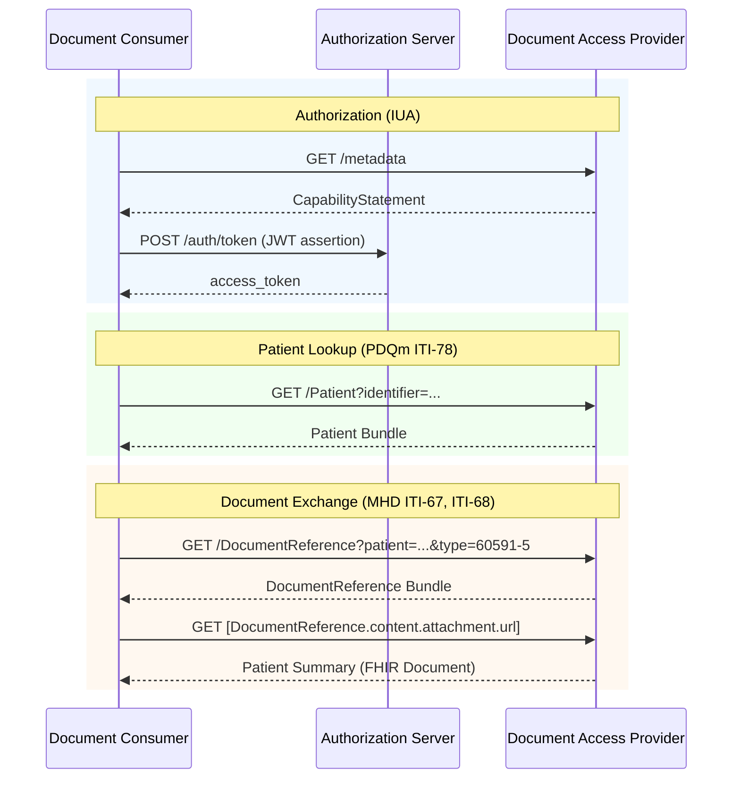

This example walks through a complete workflow for accessing a Patient Summary document for a known patient.

### Scenario

A patient presents to a care provider, but his data is in another system. The current care provider is a **Document Consumer**, and the system with his data is a **Document Access Provider**.

### Actors

- **[Document Consumer](actors.html#document-consumer)** - The healthcare provider's system requesting the Patient Summary
- **[Document Access Provider](actors.html#document-access-provider)** - The system holding the patient's health data

### Prerequisites

- Document Consumer has registered with Document Access Provider and obtained authorization credentials
- Patient has a known identifier in the Document Access Provider system
- Document Access Provider supports European Patient Summary priority category

### Sequence Diagram



*Note: This diagram assumes the Authorization Server is grouped with the Document Access Provider. See [Authorization Server Deployment](authorization.html#authorization-server-deployment) for discussion of alternative deployments.*

### Step-by-Step Flow

#### Step 1: Discover Capabilities

Document Consumer inspects the Document Access Provider's capabilities via [Capability Discovery](capability-discovery.html).

```
GET https://provider.example.org/fhir/metadata
```

The CapabilityStatement confirms support for IHE MHD document exchange, PDQm patient search, and European Patient Summary priority category.

#### Step 2: Obtain Authorization Token

Document Consumer requests an access token using SMART Backend Services ([Authorization](authorization.html)).

```
POST https://provider.example.org/auth/token
Content-Type: application/x-www-form-urlencoded

grant_type=client_credentials
&scope=system/Patient.rs system/DocumentReference.rs system/Bundle.r
&client_assertion_type=urn:ietf:params:oauth:client-assertion-type:jwt-bearer
&client_assertion=[signed JWT]
```

#### Step 3: Identify the Patient

Document Consumer searches for the patient using a known identifier ([Patient Lookup](patient-match.html)).

```
GET https://provider.example.org/fhir/Patient?identifier=urn:oid:2.16.840.1.113883.2.4.6.3|123456789
Authorization: Bearer [access_token]
```

Response includes the Patient resource with `id=patient-123`.

#### Step 4: Search for Patient Summary Document

Document Consumer queries for Patient Summary documents using **IHE MHD ITI-67** (Find Document References) transaction ([Document Exchange](document-exchange.html)).

```
GET https://provider.example.org/fhir/DocumentReference?patient=patient-123&type=http://loinc.org|60591-5
Authorization: Bearer [access_token]
```

Response Bundle contains DocumentReference resources for available Patient Summaries. A typical DocumentReference entry looks like:

```json
{
  "resourceType": "DocumentReference",
  "id": "docref-eps-123",
  "status": "current",
  "type": {
    "coding": [{
      "system": "http://loinc.org",
      "code": "60591-5",
      "display": "Patient summary Document"
    }]
  },
  "category": [{
    "coding": [{
      "system": "urn:oid:1.3.6.1.4.1.19376.1.2.6.1",
      "code": "SUMMARIES",
      "display": "Summaries"
    }]
  }],
  "subject": {
    "reference": "Patient/patient-123"
  },
  "date": "2024-03-15T10:30:00Z",
  "content": [{
    "attachment": {
      "contentType": "application/fhir+json",
      "url": "Bundle/ips-bundle-456"
    },
    "format": {
      "system": "http://ihe.net/fhir/ihe.formatcode.fhir/CodeSystem/formatcode",
      "code": "urn:ihe:pcc:ips:2020",
      "display": "International Patient Summary"
    }
  }]
}
```

#### Step 5: Retrieve Document Content

Document Consumer retrieves the document content using **IHE MHD ITI-68** (Retrieve Document) transaction. The URL is taken from `DocumentReference.content.attachment.url`.

```
GET https://provider.example.org/fhir/Bundle/ips-bundle-456
Authorization: Bearer [access_token]
```

Response is the Patient Summary as a FHIR Document (Bundle of type `document`) in JSON format.

> **Note:** Patient Summary (IPS) is a FHIR Document, so it is retrieved as a Bundle resource, not a Binary. See [Document Exchange - Document Content](document-exchange.html#document-content) for details.

### Key Points

- All resource access requires [authorization](authorization.html)
- Patient identification precedes health data queries
- DocumentReference contains metadata about documents
- FHIR Documents (IPS, etc.) are retrieved as Bundle resources; DICOM KOS imaging manifests ([IHE MADO](priority-area-imaging-manifest.html#ihe-mado)) are retrieved as Binary resources
- All transactions use standard FHIR RESTful interactions

### Variations

- If patient identifier is not known, use [Patient $match operation](patient-match.html)
- If Document Access Provider supports [Resource Access](resource-access.html), Consumer could query for individual resources instead of documents
- Multiple documents may be returned if patient has been seen multiple times
